# Flow — Kuron Studio

## 1. Arsitektur High-Level

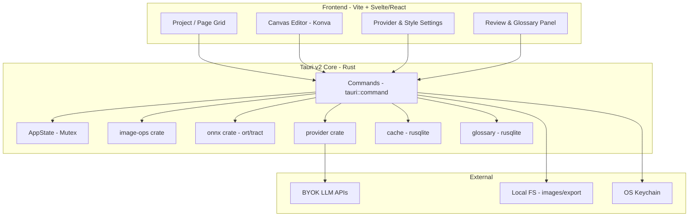

## 2. Pipeline Kuron (As-Is) → Studio (To-Be)

**Kuron App (Flutter):**
```
capturePage(bytes,w,h) -> prefetchDetection (ONNX bg) -> translatePage:
  1. WebtoonDetector (long-strip? -> chunk)
  2. detectBubbles (ONNX via kuron_native) -> BubbleBox
  3. postProcessBoxes (merge, drop SFX)
  4. if empty -> FallbackImageHandler.compressPage (1280px, JPEG85) + fullImagePrompt (% coords)
     else -> MosaicBuilder.buildMosaic (crop 20% pad, 2x, label merah, cap 2MB/1MB)
  5. AiProviderFactory -> OpenAI/Gemini/Cohere -> translatePage(...)
  6. ModelJsonParser + mapMosaicResult -> PageTranslation
  7. TranslationCacheRepository.put + overlay render
```

**Kuron Studio (Tauri Rust) — reuse 1:1:**
```
import_pages -> detect_bubbles (ONNX Rust) -> edit bubbles (canvas) -> translate_page (mosaic/compress -> LLM) -> post-edit -> export
```

## 3. Sequence: Translate Satu Halaman

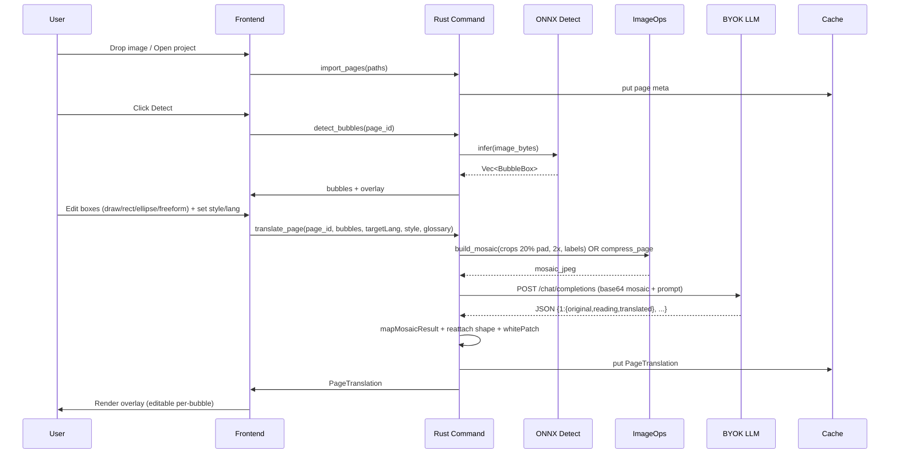

## 4. State Machine: Page

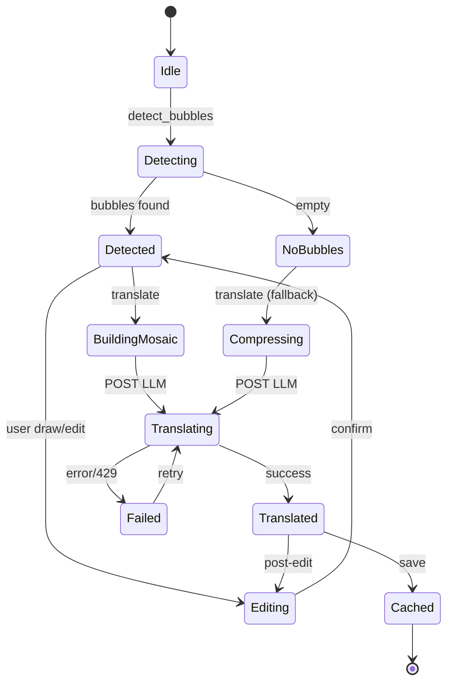

## 5. Data Flow: Mosaic

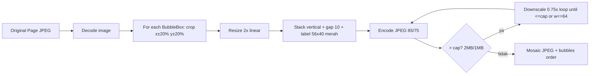

**Detail Mosaic (port dari `MosaicBuilder`):**
- Crop: `padX = w*0.2`, `padY = h*0.2`, clamp ke image bounds
- Scale: `copyResize 2x linear`
- Layout: `totalWidth = max(chip.width)`, `totalHeight = sum(chip.height+gap)-gap+labelHeight`
- Fill: white `255,255,255`, label red `255,0,0` font `arial48`
- Cap: `high=2MB/85%`, `low=1MB/75%` — Rust fast path hanya untuk high, low pakai Dart encoder (di Studio: 100% Rust)

## 6. Data Flow: Fallback (No Bubble)

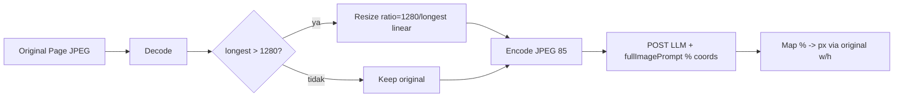

## 7. Batch Flow

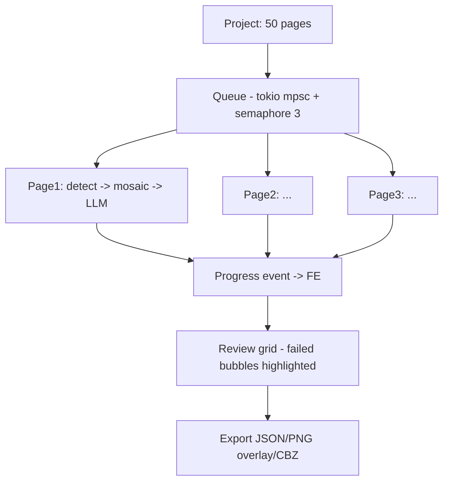

**Concurrency:** semaphore 3 untuk hindari 429 & OOM. Progress via `tauri::emit("translate_progress", {page_id, done, total})`.

## 8. Provider Flow

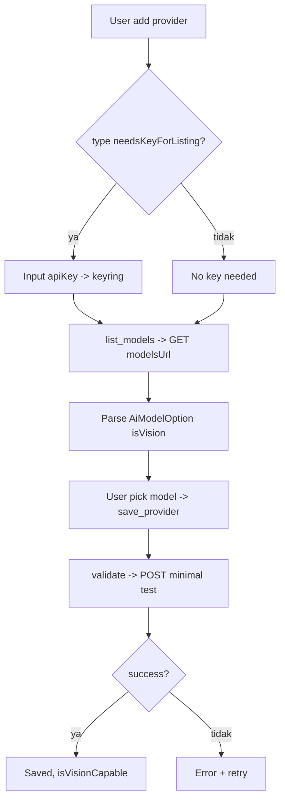

**9 Provider Types:**
`zen` (opencode.ai/zen/v1), `openCodeGo` (zen/go/v1), `gemini` (Google REST), `openAi`, `openRouter`, `metaAi`, `clinePass`, `cohere` (/v2/chat), `custom` (manual baseUrl)

## 9. Glossary Flow

> **Bug sebelumnya:** label mermaid pakai `"` dan `->` di dalam node (`Prompt += 'Glossary:\n\"a\" -> \"b\"'` dan `Save new terms? -> glossary_save`) bikin parser mermaid error + flow kelewat linear (tidak tunjukkan seleksi limit 5, fallback, dan save via long-press). Sudah diperbaiki di bawah — sekarang mirror logic Kuron `selectRelevantGlossaryEntries` + `buildGlossaryBlock` + `_glossaryContextFor`.

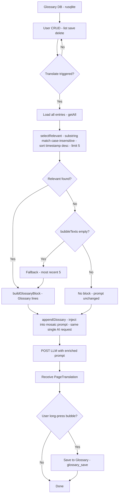

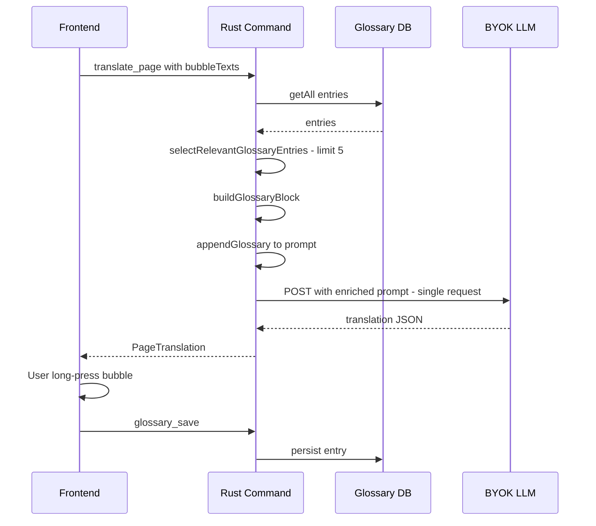

**Logic detail (port 1:1 dari Kuron `reader_translation_cubit.dart`):**
- `glossaryMaxEntries = 5` — max entries per prompt
- `selectRelevantGlossaryEntries(entries, bubbleTexts)` — `sourceText` substring case-insensitive di `bubbleTexts`, sort `timestamp` desc, take 5. Empty `bubbleTexts` atau no match dengan known texts → fallback most-recent 5 (fresh page). Empty glossary atau true no-match → `null` (prompt unchanged).
- `buildGlossaryBlock(entries)` → `Glossary:\n"src" -> "dst"\n...` — embedded di **satu** AI request yang sama, **tidak pernah** extra call.
- `appendGlossary(prompt, glossaryContext)` — null/empty = prompt unchanged.
- `_glossaryContextFor(bubbleTexts)` — load via `GlossaryRepository.getAll()` (Kuron: `SharedPreferences` JSON list; Studio: `rusqlite` `glossary.db`), never throws.
- Save: **bukan** auto setelah translate — user **long-press bubble → Save to Glossary** (`SaveGlossaryEntryUsecase` → `GlossaryEntry{id, sourceText, translatedText, reading, contentId, pageIndex, timestamp}`), lalu tersedia untuk translate berikutnya.

## 10. Export Flow

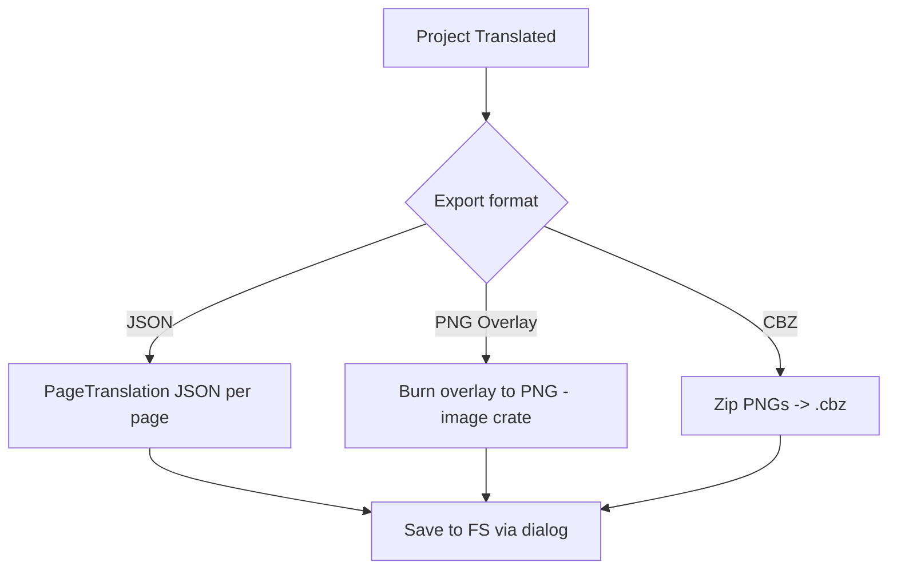

## 11. Error & Retry Flow

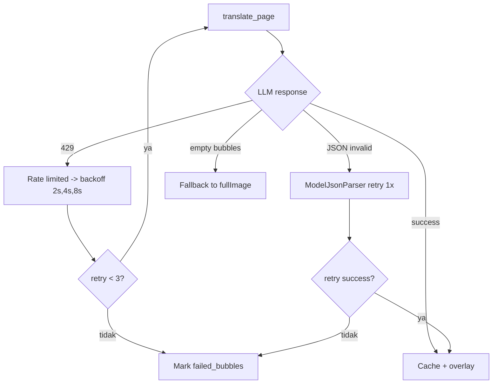

## 12. File Structure Flow

```
kuron-studio/
├── src/                 # frontend
│   ├── routes/
│   │   ├── +layout.svelte
│   │   ├── project/[id]/+page.svelte  # grid + batch
│   │   ├── editor/[pageId]/+page.svelte # canvas
│   │   └── settings/+page.svelte      # providers
│   ├── lib/canvas/      # Konva overlay, shape editor
│   └── lib/stores/      # project, provider, glossary
└── src-tauri/
    ├── Cargo.toml
    ├── tauri.conf.json  # bundleId id.kuron.studio
    ├── capabilities/default.json
    ├── resources/models/bubble.onnx
    └── src/
        ├── lib.rs       # setup, AppState
        ├── commands/    # project, image, detect, translate, glossary, provider
        └── crates/      # image-ops, onnx-detect, provider, prompt, parser
```
