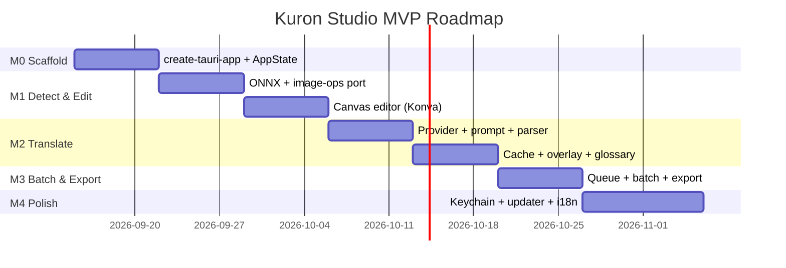
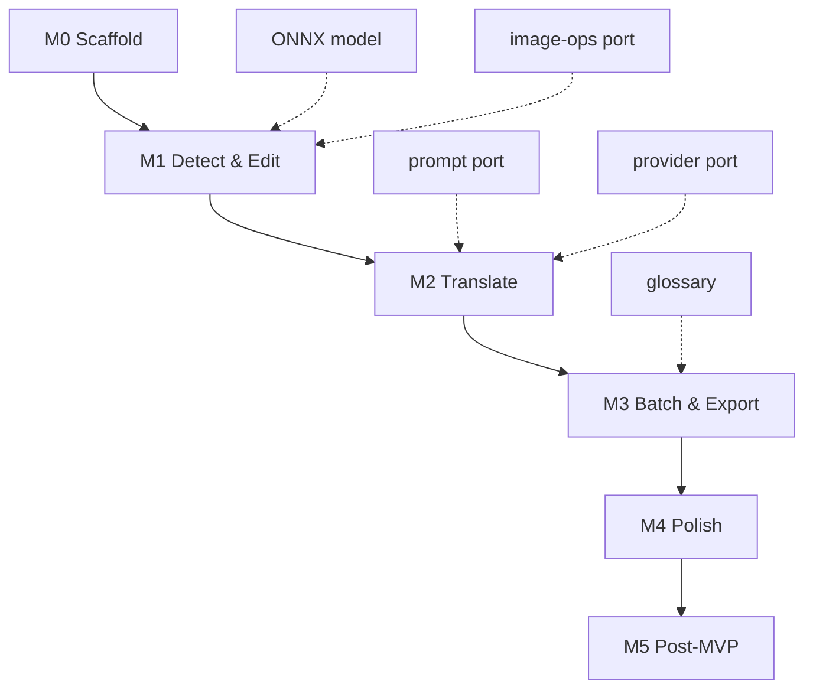

# Roadmap — Kuron Studio

## Timeline 6-8 Minggu (MVP)

## Phase Detail

### Phase 0 — Scaffold (Minggu 1)

**Goal:** App jalan, bisa import & preview image.

| Task | Deliverable | Est |
|------|-------------|-----|
| `pnpm create tauri-app kuron-studio --template svelte` | Scaffold | 1d |
| `tauri.conf.json` (id.kuron.studio, window, bundle) | Config | 0.5d |
| `capabilities/default.json` (ACL) | Security | 0.5d |
| `AppState` (Mutex<ProjectStore>) + `store.json` | State | 1d |
| `import_pages` + `get_image_preview` (thumbnail 512px) | FS | 2d |
| Project grid UI (Svelte) | Frontend | 2d |

**Exit criteria:** `pnpm tauri dev` jalan, drag-drop folder → grid thumbnails.

### Phase 1 — Detect & Edit (Minggu 2-3)

**Goal:** Deteksi bubble otomatis + edit manual di canvas.

| Task | Deliverable | Est |
|------|-------------|-----|
| Port `image-ops` crate dari `kuron_native/rust` | Rust | 2d |
| Bundle `bubble.onnx` + `ort` integration | ONNX | 3d |
| `detect_bubbles` + `detect_bubbles_batch` commands | Rust | 2d |
| Canvas editor (Konva): rect/ellipse/freeform/tail | Frontend | 4d |
| Shape persistence (BubbleBox.shape) | Both | 1d |
| Postprocess (merge, confidence filter) | Rust | 1d |

**Exit criteria:** Import 1 halaman → Detect → 5 bubbles muncul di canvas → bisa drag/resize/delete.

### Phase 2 — Translate Single (Minggu 4-5)

**Goal:** Translate 1 halaman via BYOK LLM.

| Task | Deliverable | Est |
|------|-------------|-----|
| Port `prompt` crate (mosaic/full + sfxRule + glossary) | Rust | 2d |
| Port `provider` trait + 3 impl (OpenAI/Gemini/Cohere) | Rust | 4d |
| `ModelJsonParser` (strip markdown, parse JSON) | Rust | 1d |
| `translate_page` command (mosaic/compress → LLM → map) | Rust | 2d |
| Provider settings UI (CRUD 9 types, LOV, validate) | Frontend | 3d |
| Translate panel (lang, style 7, skipSfx, quality) | Frontend | 2d |
| Cache (rusqlite) + overlay render (shape-aware) | Both | 2d |
| Per-bubble edit (original/reading/translated) | Frontend | 2d |

**Exit criteria:** Pilih provider → Translate → overlay terjemahan muncul → bisa edit per-bubble.

### Phase 3 — Batch & Export (Minggu 6)

**Goal:** Batch 50 halaman + export.

| Task | Deliverable | Est |
|------|-------------|-----|
| Queue (`tokio::mpsc` + semaphore 3) + progress events | Rust | 3d |
| `translate_batch` + `retry_bubble` | Rust | 2d |
| Glossary CRUD + `appendGlossary` injection | Both | 2d |
| Export JSON + PNG overlay + CBZ | Rust | 3d |
| Review grid (failed bubbles highlighted) | Frontend | 2d |

**Exit criteria:** Batch 10 halaman → progress bar → export JSON/PNG.

### Phase 4 — Polish (Minggu 7-8)

**Goal:** Production-ready.

| Task | Deliverable | Est |
|------|-------------|-----|
| OS keychain (`keyring` + `stronghold` fallback) | Rust | 2d |
| Model LOV live-fetch + `isVisionCapable` | Both | 1d |
| MosaicQuality toggle (low/high) | Both | 1d |
| RTL/LTR + whitePatch heuristic | Both | 1d |
| i18n (en/id/zh) + theming | Frontend | 2d |
| Tauri updater + GitHub Releases | Rust | 2d |
| CI (cargo test/clippy + pnpm test + tauri build matrix) | CI | 1d |

**Exit criteria:** Build `.msi`/`.dmg`/`.deb`, updater jalan, i18n lengkap.

## Phase 5 — Post-MVP (Backlog)

| Fitur | Priority | Est |
|-------|----------|-----|
| TM Search | P2 | 1w |
| QA Checks (untranslated, overflow) | P2 | 1w |
| PSD export (layer per bubble) | P2 | 1w |
| Auto-typeset (burned-in) | P3 | 2w |
| Plugin prompt per genre | P3 | 1w |
| Kolaborasi (git/zip share) | P3 | 1w |

## Dependencies

## Risks & Mitigations

| Risk | Impact | Mitigation |
|------|--------|------------|
| ONNX model tidak akurat di desktop | High | Threshold tuning + manual override |
| LLM JSON invalid | Medium | Parser robust + retry 1x + fallback |
| 429 saat batch | Medium | Semaphore 3 + backoff |
| Bundle > 80MB | Low | ONNX download on-demand |
| Key bocor | High | Keyring + redact logs |

## Success Metrics

| Metric | MVP Target | Post-MVP |
|--------|------------|----------|
| Import 50 halaman | < 5s | < 3s |
| Detect 1 halaman | < 2s | < 1s |
| Translate 1 halaman | < 15s | < 10s |
| Batch 10 halaman | < 3m | < 2m |
| Bundle size | < 80MB | < 50MB |
| Provider adoption | 10 tim / 3 bulan | 50 tim / 6 bulan |
