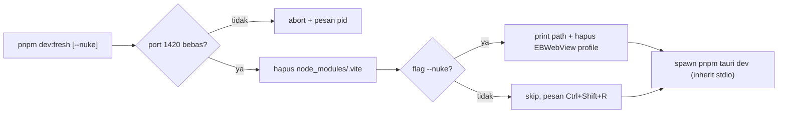

## Context

`pnpm tauri dev` menjalankan dua proses: `beforeDevCommand` (`pnpm dev` → Vite di `:1420`, `strictPort: true`) yang diserve ke webview via `devUrl`, dan backend Rust incremental di `src-tauri/target/`. Investigasi di mesin dev (Windows 11) menemukan lokasi pasti tiap lapisan:

- L1 Vite optimizer: `kuron-studio/node_modules/.vite`
- L2 cargo: `kuron-studio/src-tauri/target/` (fingerprint, terpercaya)
- L3 WebView2 profile+HTTP cache: `%LOCALAPPDATA%\id.kuron.studio\EBWebView` (terverifikasi ada)
- L4 data user (BUKAN cache): `%APPDATA%\id.kuron.studio\kuron-studio\` (`projects.json` 166B + `kuron-studio.db`) — selamanya di luar jangkauan script ini

Port 1420 saat ini bebas (tidak ada proses zombie). Tidak ada dependency baru yang boleh masuk (`package.json` dikunci minimal).

## Goals / Non-Goals

**Goals:**

- Satu perintah `pnpm dev:fresh` yang membuat developer yakin frontend yang jalan = source di disk.
- Mode `--nuke` eksplisit untuk kasus profile WebView2 bandel.
- Gagal cepat dengan pesan jelas bila port 1420 dipakai proses zombie.

**Non-Goals:**

- Wipe `target/`, hapus data user, ubah config Vite/Tauri, sentuh CI.

## Decisions

### D1: Script Node stdlib (`scripts/dev-fresh.mjs`), bukan `.ps1` / `.sh` / `tsx`

Rationale: repo mendukung 3 OS (CI matrix Win/macOS/Linux); `.mjs` jalan di semua tanpa dep baru dan tanpa shell-quoting issue PowerShell vs bash. `node:fs`, `node:net` (cek port), `node:child_process` (spawn `tauri dev`) cukup — tidak perlu `execa`, `rimraf`, `commander`.

Alternatif dipertimbangkan: inline `rimraf node_modules/.vite && tauri dev` di `package.json` — ditolak, tidak bisa cek port, tidak bisa `--nuke` kondisional, dan `rimraf` = dep baru.

### D2: Closed-list — script hanya boleh hapus 2 path

- Default: `<repo>/kuron-studio/node_modules/.vite`
- `--nuke` saja: + profile WebView2 per-OS (Windows `%LOCALAPPDATA%\id.kuron.studio\EBWebView`; macOS `~/Library/Application Support/id.kuron.studio/`; Linux `~/.local/share/id.kuron.studio/` — folder tidak ada → skip + pesan, bukan error).

Rationale: insiden "script dev menghapus data user" adalah kategori bug yang tidak bisa di-undo. Closed-list + print-sebelum-hapus membuat tiap penghapusan auditable. Penambahan target baru butuh amend spec `dev-fresh`, bukan commit diam-diam.

### D3: L2/L4 eksplisit dikecualikan (dengan alasan tercatat)

- `target/` tidak disentuh: fingerprint cargo terpercaya; wipe mengubah dev-loop 30 detik jadi 5+ menit tanpa bukti masalah. Verifikasi L2 = `cargo build` (recompile = ada yang berubah; instan = backend memang tidak berubah).
- `%APPDATA%\id.kuron.studio` tidak disentuh bahkan dengan `--nuke`: `projects.json` + sqlite adalah data project, bukan cache. Bila dicurigai data korup, itu alur manual terpisah (backup dulu), bukan bagian script ini.

### D4: Script tidak auto-hard-reload webview

Hard-reload (`Ctrl+Shift+R`) tetap langkah manual setelah `tauri dev` naik — mengotomatisasinya butuh CDP/automation ke WebView2, over-engineering untuk masalah yang diselesaikan satu keypress. Script hanya mencetak pengingatnya.

Reuse map Kuron -> Studio: tidak ada (tooling dev-loop murni). Crate boundary tidak tersentuh — script berhenti di spawn `tauri dev`.

## Risks / Trade-offs

- [Risk] Path profile WebView2 macOS/Linux belum terverifikasi di mesin (hanya Windows yang dicek) → Mitigasi: logika skip-bila-tidak-ada + pesan; verifikasi pemilik Mac/Linux saat pertama pakai.
- [Risk] `--nuke` menghapus localStorage dev (theme/lang pref hilang) → Mitigasi: default OFF, flag eksplisit, print path dulu; pref kecil dan gampang diset ulang.
- [Risk] `node_modules/.vite` dihapus saat Vite zombie masih jalan → Mitigasi: cek port 1420 dulu; bila dipakai → abort dengan pesan, jangan lanjut hapus.
- [Trade-off] Script Node menambah 1 file tooling (~60 baris) untuk masalah yang 90% selesai dengan hapus folder manual → Diterima: standarisasi antar-OS + guard port + `--nuke` aman lebih murah dari 3 orang debug cache berbeda-beda.
