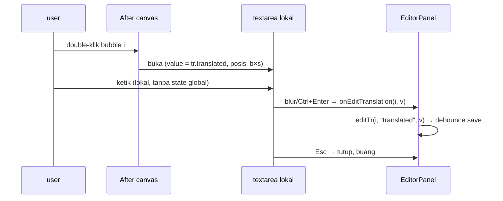

# Design: edit-in-bubble (edit translated langsung di badan bubble)

## Context

State hari ini (`EditorPanel.svelte`, `CanvasEditor.svelte`):

- After pane = `CanvasEditor` kedua dengan `editable={false}`, `tool="select"`,
  `onChange={() => {}}`, overlay `Konva.Text` + `Konva.Rect` (`listening: false`)
  dibangun ulang tiap `redraw()` (`overlayLayer.destroyChildren()`).
- Klik bubble di After → `group.on("click tap")` → `onSelectForward(i)` →
  `manualSel` di `EditorPanel` (seleksi dua arah sudah ada, dipakai ulang).
- Edit hari ini = `editTr(i, field, v)` → `isUserEdited: true` →
  `queueSaveTranslationEdits()` (debounce 500ms) → `save_translation`.
- `scale = holder.clientWidth / imgW`, internal `CanvasEditor`; semua state
  koordinat dalam px original image.

## Goals / Non-Goals

Goals: (a) double-klik bubble di After → ketik `translated` di tempat;
(b) sidebar ramping = 1 kartu terpilih; (c) jalur save existing utuh;
(d) Esc batal / blur-Ctrl+Enter commit / pindah-bubble commit-otomatis.

Non-Goals: tanpa perubahan backend; tanpa ubah autosave/baseline/cancel;
tanpa editor di Before; tanpa hapus `Save edits`.

## Decisions

### D1 — textarea HTML melayang, bukan Konva.Text editable

Konva tidak punya text-editing bawaan. Pola standar: `<textarea>` HTML
absolute di atas stage container, posisi = `(b.x*s, b.y*s, b.w*s, min-h)`.

Ditolak: mengedit via `Konva.Text` + `contentEditable` — Konva node bukan
DOM, fokus/keyboard virtual tidak reliable di WebView Tauri.
Ditolak: prompt/modal terpisah — memutus konteks "edit di tempat".

### D2 — ketikan lokal, commit sekali (anti redraw-per-huruf)

Effect `translations; showTranslation; externalSelected → redraw()` me-rebuild
overlay tiap `translation.bubbles` berubah. Menulis state per keystroke =
fokus kedip + rebuild tiap huruf.

```
textarea.value (lokal) --dblclick--> init dari tr.translated
  --blur / Ctrl+Enter--> onEditTranslation(i, value) --> editTr(i,"translated",v)
  --Esc----------------> tutup, buang, tanpa tulis
  --klik bubble lain---> commit otomatis nilai berjalan, lalu pindah seleksi
```

Ditolak: controlled-bind langsung ke `translation.bubbles` — memicu redraw
per huruf (risiko fokus amblas, § Risks proposal).

### D3 — sidebar N kartu → 1 kartu `manualSel`

`{#each translation.bubbles}` → `{#if selectedBubble}` di mana
`selectedBubble = translation.bubbles.find(manualSel) ?? fallback pertama`.
Isi kartu = 3 textarea existing + ↺ + badge + glossary `pressStart`/`pressEnd`
(pindah rumah, logika sama). Bila `manualSel === null` → placeholder
"klik / double-klik bubble di After".

Header (`translated` badge + `Save edits` + hint) tetap di atas kartu.

### D4 — font/tema/ukuran meniru overlay (WYSIWYG)

- `fontSize` textarea = rumus `fs` existing:
  `clamp(10..18, w*s / max(8, len/2))`.
- Tema: `needsWhitePatch` → teks `#111` di atas `#fff`; selain itu teks
  `#fff` di atas `rgba(0,0,0,0.65)`.
- Tinggi: `min-h = max(b.h*s, …)`, boleh tumbuh ke bawah (ikut perilaku
  overlay `max(b.h*s, txt.height()+6)`), `width = b.w*s`.

`ponytail:` bila diprotes — ekstrak rumus `fs`/tema ke helper `lib/`
bersama agar overlay + textarea satu sumber; ceiling = shared module.

### D5 — kabel canvas→panel satu fungsi

`CanvasEditor` dapat props baru (opsional, default mati agar Before aman):

```
onEditTranslation?: (i: number, value: string) => void
onDblClickBubble?: (i: number) => void   // atau reuse onSelectForward + dblclick
```

After meneruskan ke `editTr(i, "translated", v)`; Before tidak pasang
(seleksi saja). Tanpa command Tauri baru, tanpa kontrak invoke baru.

Ditolak: menulis `translation` langsung dari canvas — satu arah data
tetap panel→canvas via props `translations` (pola existing).

## Risks / Trade-offs

- Scale berubah saat resize: textarea dihitung di dalam canvas (pemilik
  `scale()`), absolute relatif stage container → ikut scroll natural pane.
- Split mode dua `CanvasEditor` hidup: editor hanya dirender di instance
  After (guard prop), Before tak terpengaruh.
- `Isi manual` (tanpa AI): bubble tanpa teks tetap bisa double-klik →
  textarea kosong + placeholder "ketik terjemahan"; commit → jalur sama.
- Tes pola-sumber (`?raw`) tidak membuktikan fokus/posisi nyata —
  dicatat jujur di tasks;que bukti interaksi = manual E2E §3.


