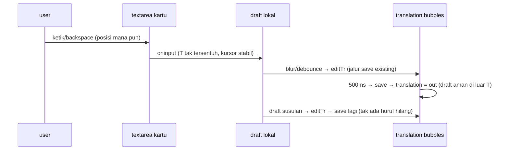

# Design: fix-edit-stuck (draft lokal, commit sekali — diperluas ke kartu)

## Context

State hari ini (`EditorPanel.svelte` pasca `edit-in-bubble`):

- Kartu tunggal `{#if selectedBubble && selectedRow >= 0}`: 3 textarea
  `value={b.<field>}` + `oninput → editTr(i, field, v)`.
- `editTr`: `translation.bubbles = translation.bubbles.map(...)` per huruf +
  `queueSaveTranslationEdits()` (debounce 500ms) → `saveTranslationEdits` →
  `translation = out` (replace penuh dari server).
- In-bubble (`CanvasEditor.svelte`): sudah draft lokal `editingValue`,
  commit sekali via `onEditTranslation` — pola yang benar.

```
kartu hari ini (SAKIT):
  keystroke → translation.bubbles = BARU → re-render → value= di-set ulang
    → kursor ke akhir  ─┐
                        ├─ "stuck"
  save(500ms) → translation = out (basi) → huruf terbaru hilang ─┘
```

## Goals / Non-Goals

Goals: (a) ketik/backspace di posisi mana pun stabil (kursor tak loncat);
(b) ketik cepat tak ada huruf hilang oleh respons save; (c) jalur save
existing utuh. Non-Goals: tanpa perubahan backend/tampilan.

## Decisions

### D1 — draft lokal per field di kartu, render dari draft saat aktif

```ts
let draft = $state<{ row: number; original: string; reading: string; translated: string } | null>(null);
```

- `oninput` kartu tulis `draft` saja (init dari `selectedBubble` saat
  `selectedRow` berubah / fokus masuk); `translation.bubbles` tak tersentuh
  → tak ada re-render `value` → kursor stabil.
- Textarea kartu baca `draft?.<field> ?? b.<field>` (draft menang saat aktif).
- Commit → `editTr(row, field, draft[field])` per field yang berubah
  (atau satu fungsi commit semua field kotor) → jalur existing
  (`isUserEdited`, debounce, badge, ↺).

Ditolak: `bind:value` langsung ke `b.translated` — `b` derived dari
`selectedBubble`, tak bisa two-way bind; dan tetap menulis state global
per huruf (tak menyelesaikan penyebab #2).

### D2 — commit di blur + debounce (bukan per huruf, bukan hanya Save)

- Blur textarea → commit field itu (pola sama seperti in-bubble).
- Ketik tanpa blur → debounce ~500ms commit (reuse ritme existing;
  implementasi boleh reuse `queueSaveTranslationEdits` dengan tahap commit
  di depan, atau timer commit sendiri → `editTr`).
- Pindah seleksi (`manualSel` berubah) saat draft kotor → commit otomatis
  dulu (konsisten dengan in-bubble "pindah = commit", anti teks hilang).
- `Save edits` tetap flush manual (tetap ada; draft di-commit dulu bila kotor).

Ditolak: commit hanya saat `Save edits` diklik — mengubah kontrak autosave
yang sudah dijanjikan ke user.

### D3 — respons save aman secara konstruksi (tanpa merge rumit)

Karena draft hidup di luar `translation`:

- `translation = out` di `saveTranslationEdits` tak pernah menyentuh huruf
  yang belum di-commit (mereka di `draft`, bukan di `translation`).
- Commit draft setelah respons tiba → `editTr` → `queueSave` → save susulan
  mengirim teks terbaru. Tak ada huruf hilang, tak perlu nomor generasi /
  merge tiga arah.

Ditolak: generation counter / field-level merge di respons — over-engineering
untuk masalah yang hilang sendiri begitu draft dipisah (YAGNI).

### D4 — in-bubble `value={editingValue}` → `bind:value={editingValue}`

Satu baris, sekalian. Perilaku identik (state sudah lokal), tapi menghilangkan
satu-satunya write-path satu arah yang tersisa di editor teks.

### D5 — draft terikat `selectedRow`, mati saat kartu tak ada
- Draft di-key ke `selectedRow` (== index baris `translation.bubbles`, bukan
  `b.index`, agar cocok dengan argumen `editTr(i, …)` existing).
- `manualSel === null` / ganti halaman (`{#key page.id}` remount) → draft
  dibuang (komponen baru = state baru; tak ada kebocoran antar halaman).

`ponytail:` bila kartu kelak multi-bubble lagi — ekstrak draft ke helper
`lib/draft.ts` (`initDraft/commitDraft`) agar kartu + in-bubble satu sumber;
ceiling = shared module.

## §4 — last-write-wins: generasi save + ↺ sinkron-menang

### Konteks §4

Setelah §1–§3, satu balapan tersisa: dua `save_translation` overlap
(draftTimer 500ms + saveTimer 500ms → tiap jeda ketik ~1 dtk = satu save).
`saveTranslationEdits` menulis `translation = out` tanpa memeriksa umur
respons — respons basi (tiba belakangan, bawa snapshot lama) menggilas
tulisan yang lebih baru. Gejala: backspace `abc→ab`, respons `abc` tiba
terakhir → `c` bangkit lagi. `resetBubble` bernasib sama: hanya membatalkan
save yang *belum dikirim*; save yang *sudah terbang* pasti tiba dan
menggilas hasil ↺.

### D6 — nomor generasi per kirim, respons basi diabaikan

```ts
let saveGen = 0;   // naik tiap kirim; respons hanya menang bila gen-nya kini
```

- `saveTranslationEdits`: `const my = ++saveGen` sebelum `await`;
  setelah `await`, `if (my !== saveGen) return;` sebelum `translation = out`
  dan `onSaved(...)` (keduanya memundurkan state — keduanya dijaga).
- Save susulan yang membawa tulisan terbaru sudah antre via `queueSave`
  existing (`editTr` tiap commit), jadi mengabaikan respons basi tak pernah
  menghilangkan data — hanya menunda tulis sampai respons terkini tiba.
- Error path (`catch` banner) tak perlu guard: banner boleh tampil dari
  save mana pun; state tak disentuh di sana.

Ditolak: `AbortController`/pembatalan Tauri invoke — invoke yang sudah
terbang tak bisa dibatalkan dari frontend; satu-satunya titik kontrol adalah
mengabaikan responsnya (inilah D6).

### D7 — ↺ kirim langsung + naikkan generasi (menang sinkron)

- `resetBubble`: buang draft (existing), tulis `ai*` + flag false, lalu
  panggil `saveTranslationEdits()` **langsung** (bukan `queueSave` 500ms)
  — menutup jendela balapan; generasi baru membuat respons save lama yang
  masih terbang otomatis basi (D6 menggugurkannya saat tiba).
- Ritme autosave untuk ketikan tetap debounce seperti sebelumnya; hanya ↺
  (aksi eksplisit user) yang sinkron — konsisten dengan ekspektasi "klik =
  terjadi sekarang".

Ditolak: menonaktifkan tombol/kartu selama save terbang — merusak UX
(autosave seharusnya tak terlihat); D6+D7 menyelesaikan tanpa mengunci UI.

## Risks / Trade-offs

- Blur-commit vs klik ↺/glossary di kartu yang sama: klik tombol kartu
  memicu blur dulu → commit jalan → ↺ me-reset termasuk teks yang baru
  diketik sepersekian detik sebelumnya. Urutan natural (blur→click), dapat
  diterima; E2E §3 mencakup skenario ini.
- Tes pola-sumber (`?raw`) tak membuktikan kursor — dicatat jujur di tasks;
  bukti interaksi = manual E2E §3 (ketik + backspace tengah kalimat +
  ketik-cepat lawan save).


