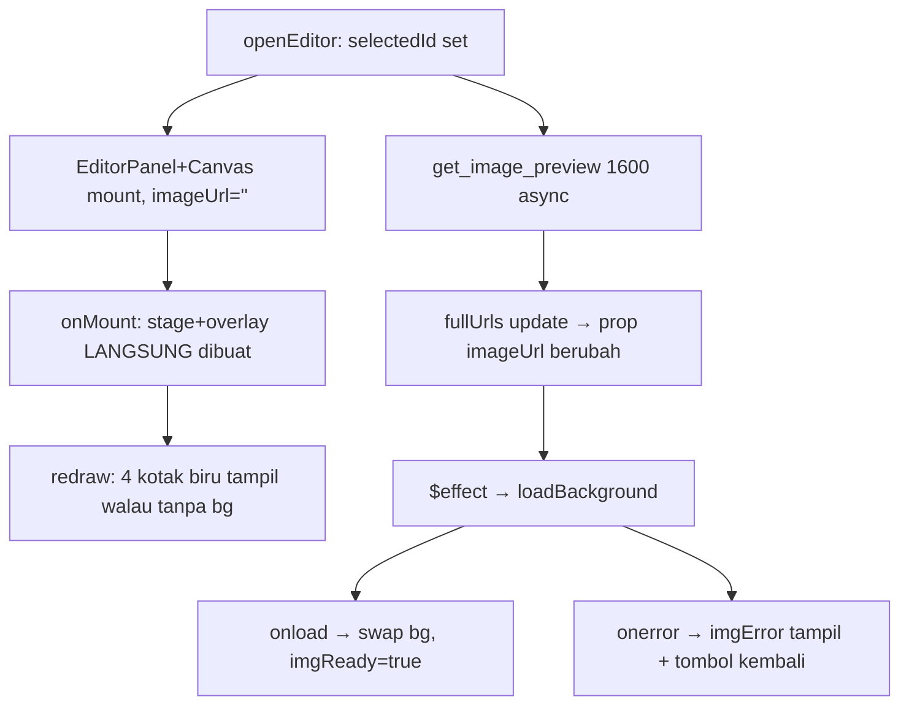

# Design: fix-editor-blank-canvas

## Konteks

`CanvasEditor.svelte` menggambar di atas Konva stage: background = gambar page,
overlay = kotak bubble + chip + handle. Model koordinat SEMUA dalam px original
image; `scale = stageW / imgW` hanya saat render/event. Parent (`App.svelte` →
`EditorPanel.svelte`) memasok `imageUrl` (data-URL dari `get_image_preview`),
`imgW/imgH`, `initial` bubbles.

## D1: Stage hidup tanpa gambar; gambar menyusul via effect

Keputusan: `onMount` SELALU buat `Konva.Stage` + `overlayLayer` + handler,
tanpa menunggu gambar. `$effect` memantau prop `imageUrl`: saat URL non-kosong
pertama tiba (atau berubah), `loadBackground(url)` membuat `Image`, dan saat
`onload` swap ke `Konva.Image` (buat layer bg baru bila belum ada, `moveToTop`
overlay agar tetap di atas). Guard `requestedUrl` mengabaikan load basi (user
pindah halaman di tengah fetch). State `imgReady`/`imgError` memberi hint
"Memuat gambar…" / pesan gagal di bawah canvas.

Sebagian D1 sudah ada di working tree (belum terverifikasi runtime karena
kemungkinan stale bundle — lihat Risks di proposal).

## D2: Error preview terlihat dari dalam editor

Keputusan: `openEditor` catch tidak lagi hanya mengandalkan banner grid
(`App.svelte:212` tertutup overlay `z-50`). Prop error diteruskan ke
`EditorPanel` (atau state `fullUrls` dibiarkan kosong + flag gagal) sehingga
editor menampilkan banner merah sendiri + tombol "← Grid" tetap aktif. Editor
tidak pernah stuck tanpa jalan keluar.

Alternatif ditolak: toast global — menambah infra baru untuk satu kasus;
cukup banner di dalam editor mengikuti pola `{#if error}` yang sudah ada di
`EditorPanel.svelte:234`.

## D3: Kontrak render yang dijamin

1. Stage + overlay SELALU ada setelah mount, terlepas dari status gambar.
2. `redraw()` tidak pernah bergantung pada `bgImage` non-null.
3. Bubble dari `initial` tampil maksimal 1 frame setelah mount (via effect
   sinkron yang sudah ada, guard JSON tetap dipertahankan).
4. Setiap kondisi gagal (URL kosong, fetch gagal, decode gagal) menampilkan
   pesan + tombol kembali — tidak ada keadaan "hitam diam".

## Crate boundary & reuse

Murni frontend (`src/lib/CanvasEditor.svelte`, `src/App.svelte`,
`src/lib/EditorPanel.svelte`). Tidak ada command Tauri baru; reuse
`get_image_preview` apa adanya. Entity `BubbleBox`/`Page` tidak berubah
(reuse Kuron 1:1, sesuai rules spec).
