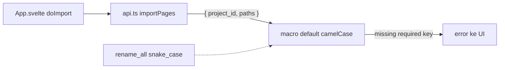

## Context

`import_pages` gagal dengan error `missing required key projectId` (camelCase), padahal signature Rust di `kuron-studio/src-tauri/src/commands/project.rs:223` adalah `import_pages(project_id: String, paths: Vec<String>, state: ...)` dan bridge `kuron-studio/src/lib/api.ts:33` sudah benar mengirim `{ project_id, paths }`.

Akar masalah kini terbukti: `tauri-macros-2.7.0` default `ArgumentCase::Camel` (`wrapper.rs:51`) — `#[tauri::command]` TANPA atribut mengharapkan key camelCase di wire (`projectId`), dan `tauri-2.12.0/src/ipc/command.rs:112` (`v.get(self.key)`) melempar `missing required key` saat frontend kirim snake_case. Jadi kedua sisi source sudah benar (Rust snake_case, bridge snake_case), tapi macro default menuntut camelCase kecuali dinyatakan lain.

Arah fix = OPSI B: sisi Rust yang menyesuaikan via `#[tauri::command(rename_all = "snake_case")]` pada ke-30 command (sudah dikerjakan main session). Frontend TIDAK diubah.

Konvensi ganda di codebase (invoke keys snake_case vs struct fields / Svelte props camelCase via serde `rename_all = "camelCase"`) tetap didokumentasikan sebagai kontrak dua lapis agar guard presisi.

## Goals / Non-Goals

**Goals:**

- Import halaman kembali memenuhi exit M0: drag-drop folder/zip/file → grid thumbnails, skip non-image terlaporkan.
- Seluruh `#[tauri::command]` (30 command) mendeklarasikan `rename_all = "snake_case"` sehingga wire key == nama param Rust.
- Regression guard di CI: command tanpa atribut atau invoke key camelCase lapis-1 gagal cepat, bukan saat runtime drag-drop.

**Non-Goals:**

- Tidak ubah `api.ts` / bridge frontend (sudah benar snake_case).
- Tidak terima dua ejaan / alias camelCase — wire key tunggal snake_case.
- Tidak ubah behavior import M0-6 (folder/zip, filename order, skip non-image).
- Tidak ubah struktur `Project` / `Page` / `ImportResult` / `specs/kuron-studio` yang sudah ada.

## Decisions

### D1: Sisi Rust yang menyesuaikan via `rename_all = "snake_case"` — frontend tidak diubah (DIBALIK)

Bukti: `tauri-macros-2.7.0` default `ArgumentCase::Camel` (`wrapper.rs:51`) + `tauri-2.12.0/src/ipc/command.rs:112` (`v.get(self.key)`). `#[tauri::command]` polos mengharapkan `projectId` di wire; frontend sudah benar kirim `project_id` sesuai nama param Rust. Fix deklaratif: 1 atribut per command (30 command), tahan lupa, tanpa runtime cost.

Alternatif yang ditolak: ubah frontend ke camelCase (merusak konsistensi 30 command demi default macro); terima dua ejaan (menambah permukaan bug, menyembunyikan kontrak).

### D2: Perburuan "pemanggil liar" GUGUR — sweep `src/` bersih (DIBALIK)

Sweep `kuron-studio/src/` tidak menemukan `invoke` langsung di luar `api.ts` dan tidak ada pengirim `{ projectId, ... }`. Terbukti BUKAN stale bundle: `dev:fresh` sudah jalan tapi error tetap muncul + screenshot menunjukkan error yang sama. Hipotesis pemanggil liar / bundle stale gugur; akar = default macro Tauri (D1).

### D3: Kontrak dua lapis TETAP — wire key kini == nama param Rust secara harfiah

- Lapis 1 — top-level invoke args: WAJIB snake_case, sama persis dengan nama param Rust (`project_id`, `page_id`, `page_ids`, `provider_id`, `bubble_texts`, `path`, `format`, `query`, `limit`, `csv`, `input`, ...). Setelah D1, tidak ada lagi translasi case di lapis 1.
- Lapis 2 — isi struct (`{ input }`): camelCase mengikuti serde `rename_all` (`pageId`, `providerId`, `targetLang`, ... untuk `TranslatePageInput` / `TranslateBatchInput` / `RetryBubbleInput` / `SaveProviderInput`).

Guard hanya cek lapis 1; isi `{ input }` dikecualikan agar tidak false-positive.

### D4: Guard TETAP — test statis murah, diperluas cek atribut Rust

Guard di `pnpm test` (vitest kecil / script, tanpa dependency baru): (a) ekstrak top-level keys tiap `invoke("<cmd>", {...})` literal di `src/`, bandingkan dengan daftar param snake_case per command; (b) cek tiap `#[tauri::command]` di `commands/*.rs` mendeklarasikan `rename_all = "snake_case"`. Gagal bila ada key camelCase lapis-1 atau command tanpa atribut.

Alternatif yang ditolak: e2e `tauri dev` + drag-drop otomatis (berat, flaky di CI 3-OS); verifikasi manual `pnpm tauri dev` cukup.

### Crate boundary & Tauri commands (yang diaudit)

| File Rust | Commands | Param lapis-1 (snake_case) |
|---|---|---|
| `commands/project.rs` | `create_project`, `get_project`, `import_pages`, `list_projects` | `name`, `project_id`, `paths` |
| `commands/image.rs` | `get_image_preview` | `path`, `max_side` |
| `commands/detect.rs` | `detect_status`, `detect_bubbles`, `detect_bubbles_batch`, `save_bubbles` | `page_id`, `page_ids`, `bubbles` |
| `commands/provider.rs` | `save_provider` (`{input}`), `get_providers`, `delete_provider`, `list_models`, `validate_provider` | `input`, `provider_id` |
| `commands/translate.rs` | `translate_page` (`{input}`), `save_translation`, `clear_cache` | `input`, `page_id`, `bubbles` |
| `commands/batch.rs` | `translate_batch` (`{input}`), `retry_bubble` (`{input}`) | `input` |
| `commands/glossary.rs` | `glossary_*` | `source`, `target`, `id`, `csv`, `bubble_texts` |
| `commands/export.rs` | `export_project` | `project_id`, `format`, `path` |
| `commands/extras.rs` | `tm_search`, `qa_check`, `share_project` | `query`, `limit`, `project_id`, `path` |

Semua command di tabel kini ber-atribut `rename_all = "snake_case"` (30 command). Frontend `api.ts` satu-satunya jalur resmi dan tidak diubah.

Reuse map Kuron -> Studio: tidak ada reuse baru; fix memakai kontrak existing (`ProjectStore::import_pages` M0-6, NOTE `api.ts` yang sudah dipertegas).

## Risks / Trade-offs

- [Risk] Atribut terlewat di command baru → error camelCase kembali. Mitigasi: guard CI menolak command tanpa atribut (atau minimal checklist review).
- [Risk] Audit menemukan mismatch di command lain (scope creep). Mitigasi: yang se-pola diperbaiki dalam change ini; yang beda pola jadi follow-up task.
- [Risk] Guard CI false-positive pada field camelCase valid di dalam `{ input }`. Mitigasi: guard hanya cek lapis 1, isi struct dikecualikan.
- [Trade-off] Guard statis tidak menangkap `invoke` dinamis (computed keys). Diterima: codebase semua literal; dynamic invoke jadi larangan konvensi.
