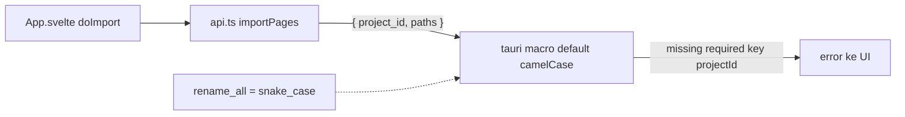

## Why

Import halaman gagal total dengan error `invalid args 'projectId' for command 'import_pages': missing required key projectId`. Akar masalah kini terbukti ada di sisi Rust, bukan frontend:

- `tauri-macros-2.7.0` default `ArgumentCase::Camel` (`wrapper.rs:51`) — `#[tauri::command]` TANPA atribut mengharapkan key camelCase di wire (`projectId`).
- `tauri-2.12.0/src/ipc/command.rs:112` melakukan `v.get(self.key)` → error `missing required key projectId` saat frontend kirim snake_case.
- Frontend `kuron-studio/src/lib/api.ts:33` sudah benar kirim snake_case `{ project_id, paths }` sesuai nama param Rust `project.rs:223-226`.

Jadi kontrak yang benar sudah ada di kedua sisi source (Rust snake_case, bridge snake_case), tapi macro Tauri menuntut camelCase di wire kecuali dinyatakan lain. Akibatnya kriteria exit M0 (drag-drop folder → grid thumbnails) rusak — seluruh pipeline import → detect → translate → export tidak bisa dimulai. Perlu diperbaiki sekarang karena ini P0 blocker, bukan polish.

Arah fix = OPSI B: sisi Rust yang menyesuaikan via `#[tauri::command(rename_all = "snake_case")]` pada ke-30 command. Frontend `api.ts` TIDAK diubah (kecuali NOTE yang sudah dipertegas).

## Scope

- `kuron-studio/src-tauri/src/commands/*.rs` — tambah `rename_all = "snake_case"` ke 30 atribut `#[tauri::command]` (sudah dikerjakan main session).
- `kuron-studio/src/lib/api.ts` TIDAK diubah — sudah benar kirim snake_case.
- Semua command dengan param `project_id`/`page_id` (`export_project`, `share_project`, `qa_check`, dst.) ikut diperbaiki — satu pola, satu perbaikan.
- Regression test + CI guard untuk kontrak invoke.

## Non-goals

- Tidak ubah `api.ts` / bridge frontend (sudah snake_case, sudah match nama param Rust).
- Tidak terima dua ejaan / alias camelCase — wire key Tunggal snake_case.
- Tidak ubah behavior import (folder/zip, filename order, skip non-image tetap seperti M0-6).
- Tidak tambah command baru, tidak ubah struktur `Project`/`Page`/`ImportResult`.

## Decisions

### D1: Sisi Rust yang menyesuaikan via `rename_all = "snake_case"` — frontend tidak diubah (DIBALIK dari versi awal)

Rationale: bukti dari screenshot + source Tauri di mesin membalikkan asumsi awal. `tauri-macros-2.7.0` default `ArgumentCase::Camel` (`wrapper.rs:51`), dan `tauri-2.12.0/src/ipc/command.rs:112` (`v.get(self.key)`) mewajibkan wire key camelCase bila atribut tidak dideklarasikan. Artinya `#[tauri::command]` polos mengharapkan `projectId` di wire, sedangkan frontend sudah benar kirim `project_id` sesuai nama param Rust. Yang salah bukan pemanggil — melainkan macro default yang tidak cocok dengan konvensi snake_case codebase. Fix deklaratif: 1 atribut `rename_all = "snake_case"` per command (30 command), tahan lupa untuk command baru, tanpa runtime cost.

Alternatif dipertimbangkan: ubah frontend ke camelCase — ditolak, merusak konsistensi snake_case 30 command + NOTE kontrak demi default macro. Terima dua ejaan (alias) — ditolak, menambah permukaan bug dan menyembunyikan kontrak.

### D2: Perburuan "pemanggil liar" gugur — sweep `src/` tidak ada invoke liar (DIBALIK dari versi awal)

Rationale: sweep `kuron-studio/src/` tidak menemukan `invoke` langsung di luar `api.ts` dan tidak ada pengirim `{ projectId, ... }`. Terbukti BUKAN stale bundle: `dev:fresh` sudah jalan tapi error tetap muncul + screenshot menunjukkan error yang sama. Jadi hipotesis "pemanggil liar / bundle stale" gugur; akar = default macro Tauri (lihat D1).

Diagram dibaca: panah solid adalah jalur yang benar tapi ditolak macro default; garis putus-putus adalah fix deklaratif yang membuat macro menerima snake_case.

### D3: Dua lapis nama didokumentasikan sebagai kontrak, bukan komentar saja (TETAP)

- Lapis 1 — top-level invoke args: WAJIB snake_case, sama persis dengan nama param Rust (`project_id`, `page_id`, `page_ids`, `provider_id`, `bubble_texts`, `path`, `format`, `query`, `limit`, `csv`, `input`, ...). Setelah D1, wire key lapis-1 == nama param Rust secara harfiah.
- Lapis 2 — isi struct (`{ input }`): camelCase mengikuti serde `rename_all` (`pageId`, `providerId`, `targetLang`, ... untuk `TranslatePageInput` / `TranslateBatchInput` / `RetryBubbleInput` / `SaveProviderInput`).

Rationale: pengecualian `{ input }` adalah sumber false-positive kalau guard ditulis naif; kontrak dua lapis membuat guard bisa presisi (cek lapis 1 saja).

### D4: Guard = test statis murah, bukan integration harness baru (TETAP)

Audit 30 command vs bridge bisa dilakukan dengan script grep/AST ringan di `pnpm test` (atau vitest kecil): ekstrak key objek pada tiap `invoke("<cmd>", {...})` di `src/` dan bandingkan dengan daftar param Rust per command, plus cek tiap `#[tauri::command]` mendeklarasikan `rename_all = "snake_case"`. Gagal bila ada key camelCase di lapis 1 atau command tanpa atribut. Tidak perlu harness Tauri baru, tidak perlu menambah dependency.

Alternatif dipertimbangkan: e2e `tauri dev` + drag-drop otomatis — ditolak untuk change ini (berat, flaky di CI 3-OS); verifikasi manual `pnpm tauri dev` cukup untuk satu command ini.

### Crate boundary & Tauri commands (yang diaudit)

| File Rust | Commands | Param lapis-1 (snake_case) |
|---|---|---|
| `commands/project.rs` | `create_project`, `get_project`, `import_pages`, `list_projects` | `name`, `project_id`, `paths` |
| `commands/image.rs` | `get_image_preview` | `path`, `max_side` |
| `commands/detect.rs` | `detect_status`, `detect_bubbles`, `detect_bubbles_batch`, `save_bubbles` | `page_id`, `page_ids`, `bubbles` |
| `commands/provider.rs` | `save_provider` (`{input}`), `get_providers`, `delete_provider`, `list_models`, `validate_provider` | `input`, `provider_id` |
| `commands/translate.rs` | `translate_page` (`{input}`), `save_translation`, `clear_cache` | `input`, `page_id`, `bubbles` |
| `commands/batch.rs` | `translate_batch` (`{input}`), `retry_bubble` (`{input}`) | `input` |
| `commands/glossary.rs` | `glossary_*` | `source`, `target`, `id`, `csv`, `bubble_texts` |
| `commands/export.rs` | `export_project` | `project_id`, `format`, `path` |
| `commands/extras.rs` | `tm_search`, `qa_check`, `share_project` | `query`, `limit`, `project_id`, `path` |

Frontend: `kuron-studio/src/lib/api.ts` satu-satunya jalur resmi dan SUDAH BENAR; `App.svelte doImport` / drag-drop / dialog semuanya lewat `api.importPages`, tidak `invoke` langsung. File Rust di atas kini wajib ber-atribut `rename_all = "snake_case"` (30 command).

Reuse map Kuron -> Studio: tidak ada reuse baru; fix ini memakai kontrak existing (`ProjectStore::import_pages` M0-6, NOTE `api.ts`).

## Risks / Trade-offs

- [Risk] Atribut `rename_all` terlewat di command baru di masa depan → error camelCase kembali. Mitigasi: guard CI menolak command tanpa atribut (atau minimal checklist review).
- [Risk] Audit menemukan mismatch di command lain (scope creep). Mitigasi: yang se-pola diperbaiki dalam change ini; yang beda pola jadi follow-up task.
- [Risk] Guard CI false-positive pada field camelCase valid di dalam `{ input }`. Mitigasi: guard hanya cek top-level invoke keys (lapis 1), isi struct dikecualikan.
- [Trade-off] Guard statis tidak menangkap `invoke` yang dibangun dinamis (computed keys). Diterima: codebase saat ini semua literal; dynamic invoke jadi larangan konvensi ke depan.
