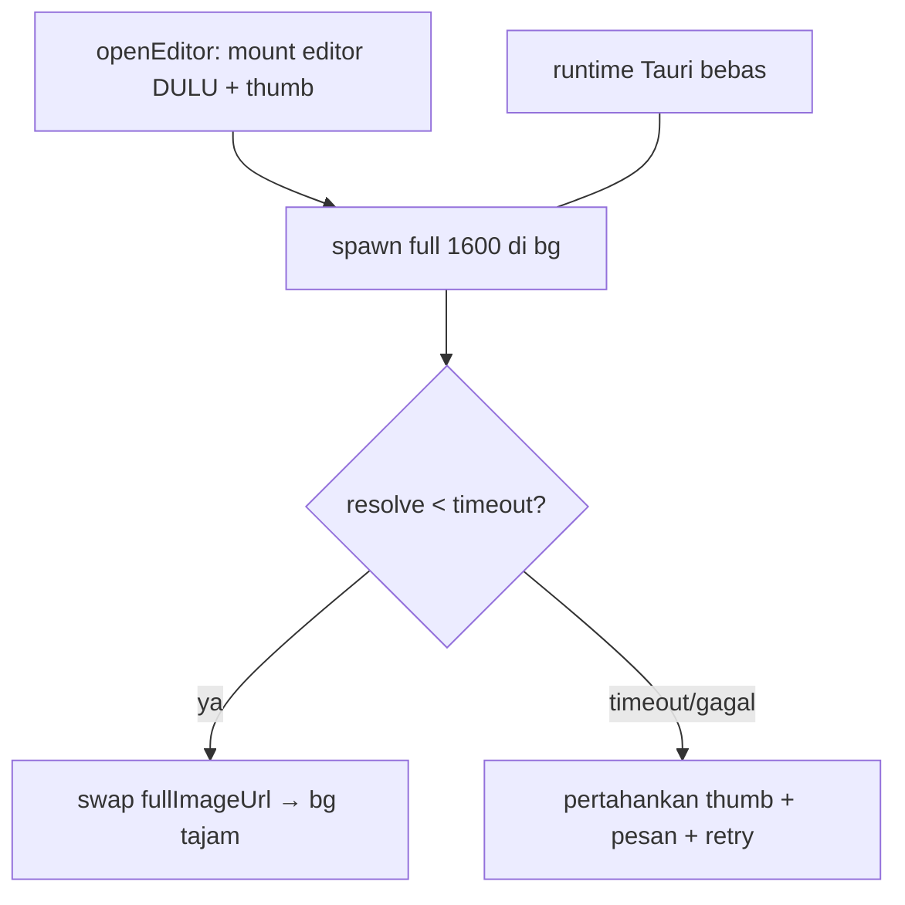

# Design: fix-preview-hang

## Konteks

Alur gambar editor hari ini (sinkron, rapuh):

```
App.openEditor ──await──▶ get_image_preview(path, 1600) [SYNC di runtime async]
      │                        read + decode + resize + JPEG encode (detik–hang)
      ▼
fullUrls[id] = dataURL ──▶ EditorPanel(fullImageUrl) ──▶ Canvas.loadBackground
                                                                  img.src = url
                                                  onload/onerror tak fire → "Memuat…" selamanya
```

Bukti dari repo: `image.rs:7` `pub fn` sinkron; `detect.rs:99`,
`batch.rs:243`, `translate.rs:256` sudah `spawn_blocking`. Hanya preview yang
tertinggal.

## D1: Backend non-blocking (ikuti pola detect)

Keputusan: jadikan `get_image_preview` `async` + pindahkan kerja berat ke
`tauri::async_runtime::spawn_blocking` (pola persis `detect_bubbles`).
Error `String` dipertahankan 1:1 (`read failed: …`, `decode failed: …`).
Wire key tidak berubah (`{path, max_side}`) — `async` tidak memengaruhi
kontrak invoke L1. Test existing `missing_file_errors` dijadikan async.



## D2: Progressive open — thumb dulu, full menyusul

Keputusan: `openEditor` tidak `await` full sebelum mount. `selectedId` diset
langsung; `fullUrls[id] ?? thumbs[id]` sudah memberi thumb 512 (terbukti
tampil di grid) sebagai background pertama. Fetch full 1600 jalan paralel;
saat resolve, prop update → `$effect` swap (guard `requestedUrl` yang sudah
ada mengabaikan urutan basi). Bila gagal/timeout → `openError` (lane-2 sudah
ada) + thumb tetap tampil → editor usable, bukan hitam.

Alternatif ditolak: naikkan JPEG quality / turunkan max_side global — merusak
kualitas editor demi menutup bug transport; thumb+full bertingkat memberi
keduanya.

## D3: Load defensif di CanvasEditor (timeout + fallback + retry)

Keputusan: `loadBackground` diberi timeout (15s, konstanta bernama) —
`onload`/`onerror`/timeout mana yang fire duluan menang (guard token per
request). Timeout → `imgError` + tombol "Coba lagi" (panggil ulang
`loadBackground(requestedUrl)` tanpa remount). Fallback otomatis: prop baru
opsional `fallbackUrl` (thumb); bila full gagal, coba thumb sebelum menyerah.
Tidak ada keadaan "memuat selamanya": setiap request berakhir di
siap/gagal-timeout.

## D4: Kontrak waktu yang dijamin
1. Editor mount ≤1 frame dengan thumb/placeholder — tidak pernah menunggu full.
2. Tiap request gambar berakhir ≤15s di siap ATAU gagal-berpesan + retry.
3. Runtime Tauri tidak diblokir preview (spawn_blocking) — detect/translate
   tetap jalan selama gambar dimuat.
4. `redraw()` overlay tetap independen (warisan change sebelumnya).

## D5: $state.snapshot untuk salinan reactive (ganti structuredClone)

Keputusan: semua 8 `structuredClone(x)` atas data reactive diganti
`$state.snapshot(x)` — rune bawaan Svelte 5, tanpa import. `structuredClone`
gagal menelusuri `$state` Proxy → `DataCloneError` tepat saat array bubble
non-kosong (pasca-detect), mematikan effect sinkron `CanvasEditor.svelte:47`
dan mengosongkan overlay walau sidebar sehat. `$state.snapshot` menerima proxy
maupun plain dan mengembalikan plain deep copy — perilaku identik dengan
`structuredClone` yang berhasil, tanpa throw. Cakupan: `CanvasEditor.svelte`
6 titik (effect sync + 5× `onChange`), `EditorPanel.svelte` 2 titik
(`syncFromPage` + restore translation).

## D6: Hapus = persist (perbaiki jalur, bukan guard)

Keputusan: tombol hapus sidebar + delete keyboard memanggil `save()` langsung
(persist backend + `onSaved` → prop `page` ikut N-1 → guard JSON di
`syncFromPage` diam karena konten identik). Guard TIDAK di-disable — ia
melindungi reset saat ngetik terjemahan. Selama `saving`, kontrol hapus
di-disable (cegah race splice ganda); error save tampil di banner existing.
Canvas ikut update: sidebar delete meneruskan perubahan ke `CanvasEditor`
(prop `initial` berubah → effect sync), keyboard delete sudah lewat `onChange`.

Alternatif ditolak: hapus guard JSON — akan mengembalikan bug reset-dirty
saat ngetik (alasan guard dibuat).

## Crate boundary & reuse

- Rust: `commands/image.rs` saja (async + spawn_blocking); reuse pola
  `detect.rs:99`. Entity `Page`/`Project` tak berubah.
- Frontend: `App.svelte` (progressive open), `CanvasEditor.svelte` (D3),
  `EditorPanel.svelte` (teruskan `fallbackUrl` = thumb bila murah).
- `ponytail:` bila data-URL 1600 tetap berat: serve via `asset:` protocol /
  temp file gantikan base64 — upgrade path dicatat di kode, bukan change ini.
