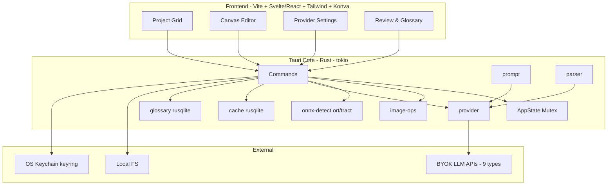

# Design: Kuron Studio MVP

## Context

Kuron Studio adalah app desktop Tauri v2 (Rust) untuk provider translate manga/manhwa. Reuse pipeline Kuron App (Flutter) 1:1: ONNX → mosaic/fallback → BYOK LLM → overlay. App terpisah (`id.kuron.studio`), tidak modifikasi `nhasixapp`. Dokumen ini menjelaskan arsitektur, crate boundary, Tauri commands, data model, dan security.

Referensi: `docs/flow.md`, `docs/tech-stack.md`, `openspec/specs/kuron-studio/spec.md`, `lib/data/repositories/ai/*`, `packages/kuron_native/rust/*`.

---

## Architecture

### High-Level



**Prinsip:**
- Rust sebagai source of truth untuk image/ONNX/prompt/parser; frontend hanya canvas + state.
- Reuse prompt & mapping Kuron 1:1 agar hasil konsisten.
- Offline-first untuk detect & image ops; online hanya untuk LLM.
- BYOK aman (OS keychain, bukan plaintext).

### Project Structure

```
kuron-studio/
├── src/                          # frontend
│   ├── routes/
│   │   ├── +layout.svelte
│   │   ├── project/[id]/+page.svelte   # grid + batch
│   │   ├── editor/[pageId]/+page.svelte # canvas
│   │   └── settings/+page.svelte       # providers
│   ├── lib/
│   │   ├── canvas/               # Konva overlay, shape editor
│   │   ├── stores/               # project, provider, glossary (Svelte stores)
│   │   └── i18n/                 # en/id/zh
│   └── app.html
├── src-tauri/
│   ├── Cargo.toml
│   ├── tauri.conf.json           # bundleId id.kuron.studio, window, bundle
│   ├── capabilities/default.json # ACL
│   ├── resources/models/bubble.onnx
│   └── src/
│       ├── lib.rs                # setup, AppState, plugin init
│       ├── commands/
│       │   ├── project.rs
│       │   ├── image.rs
│       │   ├── detect.rs
│       │   ├── translate.rs
│       │   ├── provider.rs
│       │   ├── glossary.rs
│       │   └── cache.rs
│       └── crates/
│           ├── image-ops/        # build_mosaic, compress_page, chunk_webtoon
│           ├── onnx-detect/      # model load, infer, postprocess
│           ├── provider/         # trait + openai/gemini/cohere
│           ├── prompt/           # mosaic/full + sfxRule + appendGlossary
│           └── parser/           # ModelJsonParser
└── docs/                         # sudah ada di Studio/docs/
```

---

## Crate Boundaries

| Crate | Responsibility | Input → Output | Kuron Source |
|-------|---------------|----------------|--------------|
| `image-ops` | Mosaic, compress, chunk | `Vec<u8>` + `Vec<BubbleBox>` → `Vec<u8>` JPEG | `MosaicBuilder`, `FallbackImageHandler`, `image_ops.rs` |
| `onnx-detect` | Load model, infer, postprocess | `Vec<u8>` image → `Vec<BubbleBox>` | `kuron_native` detectBubbles, `BubbleBox` |
| `provider` | Trait + 3 impl, factory, 429 handling | `Vec<u8>` mosaic + prompt → `PageTranslation` | `openai_compatible_provider.dart`, `gemini_*`, `cohere_*` |
| `prompt` | Build mosaic/full prompt, sfxRule, glossary append | `(lang, style, skipSfx, readingDir, glossary)` → `String` | `buildMosaicPrompt`, `fullImagePrompt` |
| `parser` | Strip markdown, parse JSON, preview log | `String` raw → `serde_json::Value` | `ModelJsonParser` |

**Dependency direction:** `commands` → `crates/*` → `image`/`ort`/`reqwest`. No circular deps. `prompt` and `parser` are pure (no I/O).

### image-ops Detail

```rust
// image-ops/src/lib.rs
pub fn build_mosaic(page: &[u8], bubbles: &[BubbleBox], quality: MosaicQuality) -> Result<Vec<u8>, ImageOpsError>
// - crop 20% pad each side, clamp to bounds
// - resize 2x linear (image crate)
// - stack vertical + gap 10 + label 56x40 red arial48
// - encode JPEG 85 (high) / 75 (low), cap 2MB/1MB, downscale 0.75x loop until <=cap or w<=64
// - Rust fast path for high, pure Rust for low (no Dart fallback)

pub fn compress_page(image: &[u8]) -> Result<Vec<u8>, ImageOpsError>
// - longest >1280 ? resize ratio 1280/longest linear : keep
// - encode JPEG 85

pub fn chunk_webtoon(image: &[u8], max_chunk_h: u32) -> Result<Vec<Vec<u8>>, ImageOpsError>
// - slice long-strip into <=max_chunk_h chunks, JPEG 90
```

Reuse `IMAGE_OPS_LOCK` (Mutex + catch_unwind) jika `image` crate dipanggil dari multi isolate/thread.

### onnx-detect Detail

```rust
// onnx-detect/src/model.rs
pub struct BubbleDetector { session: ort::Session }
impl BubbleDetector {
    pub fn new(model_path: &Path) -> Result<Self, OnnxError>
    pub fn detect(&self, image: &[u8]) -> Result<Vec<BubbleBox>, OnnxError>
}
// - decode image, preprocess (resize, normalize), ort session run, decode boxes
// - spawn_blocking + intra_threads=2 agar tidak block tokio

// onnx-detect/src/postprocess.rs
pub fn post_process(boxes: Vec<BubbleBox>) -> Vec<BubbleBox>
// - filter confidence <0.25
// - remove giant boxes engulfing 2.5x smaller boxes
// - optional NMS
```

Model: `resources/models/bubble.onnx` (~20-50MB), bundled atau download on-demand.

### provider Detail

```rust
#[async_trait]
pub trait AiTranslationProvider {
    async fn translate_page(&self, image: Vec<u8>, w: u32, h: u32, bubbles: Vec<BubbleBoxLike>, target_lang: &str, style: TranslationStyle, skip_sfx: bool, reading_dir: &str, glossary: Option<&str>) -> Result<PageTranslation, AiError>;
    async fn validate(&self) -> Result<(), AiError>;
    fn config(&self) -> &AiProviderConfig;
}

pub struct OpenAICompatibleProvider { config: AiProviderConfig, client: reqwest::Client }
pub struct GeminiProvider { /* Google REST */ }
pub struct CohereProvider { /* /v2/chat */ }

pub struct AiProviderFactory;
impl AiProviderFactory {
    pub fn create(config: AiProviderConfig, client: reqwest::Client) -> Box<dyn AiTranslationProvider>
}
```

Reuse Kuron: `defaultBaseUrl`, `modelsUrl`, `needsKeyForListing`, `isVisionCapable`, timeout 90s, 429 → `AiError::RateLimited`.

### prompt Detail

```rust
// prompt/src/mosaic.rs
pub fn build_mosaic_prompt(target_lang: &str, style: TranslationStyle, skip_sfx: bool, reading_dir: &str, glossary: Option<&str>) -> String
pub fn sfx_rule(skip_sfx: bool) -> String
pub fn append_glossary(prompt: String, glossary: Option<&str>) -> String

// prompt/src/full_image.rs
pub const FULL_IMAGE_PROMPT: &str = "Translate the manga/manhwa page image into {lang}...";
```

Reuse 1:1 dari `openai_compatible_provider.dart` — termasuk `readingDirection` (RTL/LTR) dan `glossaryContext` injection.

### glossary Detail (fix: sebelumnya oversimplified, sekarang mirror Kuron `reader_translation_cubit.dart`)

```rust
// glossary/src/lib.rs
pub const GLOSSARY_MAX_ENTRIES: usize = 5;

pub fn select_relevant_entries(entries: &[GlossaryEntry], bubble_texts: &[String], limit: usize) -> Vec<GlossaryEntry>
// - needle = sourceText.trim().toLowerCase(), haystacks = bubbleTexts lowercased
// - filter: haystacks.any(|h| h.contains(needle)), sort timestamp desc, take limit
// - empty entries atau empty bubbleTexts (after trim) -> empty

pub fn build_glossary_block(entries: &[GlossaryEntry]) -> String
// - format: Glossary:\n"src" -> "dst"\n...

pub async fn glossary_context_for(bubble_texts: &[String], db: &Connection) -> Option<String>
// - load getAll() sorted timestamp desc
// - if empty -> None
// - relevant = select_relevant_entries(entries, bubble_texts)
// - if relevant.is_empty() && bubble_texts.is_empty() -> fallback most-recent 5
// - if relevant.is_empty() -> None (true no-match, prompt unchanged)
// - else Some(build_glossary_block(relevant))
// - never throws, never extra AI call, injected into SAME single request via append_glossary
```

Save bukan auto setelah translate — explicit via `glossary_save` dari long-press bubble (`SaveGlossaryEntryUsecase` → `GlossaryEntry{id: gl_{ms}_{rectHash}, sourceText: original, translatedText, reading, contentId, pageIndex, timestamp: seconds}`).

---

## Tauri Commands

```rust
// commands/project.rs
#[tauri::command] fn create_project(name: String) -> Result<Project, String>
#[tauri::command] fn import_pages(project_id: String, paths: Vec<PathBuf>) -> Result<Vec<Page>, String>
#[tauri::command] fn get_project(project_id: String) -> Result<Project, String>
#[tauri::command] fn export_project(project_id: String, format: ExportFormat) -> Result<PathBuf, String>

// commands/image.rs
#[tauri::command] fn get_image_preview(page_id: String, max_w: u32) -> Result<Vec<u8>, String>

// commands/detect.rs
#[tauri::command] fn detect_bubbles(page_id: String) -> Result<Vec<BubbleBox>, String>
#[tauri::command] fn detect_bubbles_batch(page_ids: Vec<String>) -> Result<(), String> // emits detect_progress

// commands/translate.rs
#[tauri::command] async fn translate_page(page_id: String, bubbles: Vec<BubbleBox>, target_lang: String, style: TranslationStyle, skip_sfx: bool, reading_dir: String, glossary_ctx: Option<String>) -> Result<PageTranslation, String>
#[tauri::command] async fn translate_batch(page_ids: Vec<String>, opts: TranslateOpts) -> Result<(), String> // emits translate_progress, semaphore 3
#[tauri::command] async fn retry_bubble(page_id: String, bubble_idx: usize) -> Result<BubbleTranslation, String>

// commands/provider.rs
#[tauri::command] async fn list_models(provider_type: AiProviderType, api_key: Option<String>) -> Result<Vec<AiModelOption>, String>
#[tauri::command] async fn validate_provider(config: AiProviderConfig) -> Result<(), String>
#[tauri::command] fn save_provider(config: AiProviderConfig) -> Result<(), String> // key -> keyring
#[tauri::command] fn get_providers() -> Result<Vec<AiProviderConfig>, String> // redacted
#[tauri::command] fn delete_provider(id: String) -> Result<(), String>

// commands/glossary.rs
#[tauri::command] fn glossary_list() -> Result<Vec<GlossaryEntry>, String>
#[tauri::command] fn glossary_save(entry: GlossaryEntry) -> Result<(), String>
#[tauri::command] fn glossary_delete(id: String) -> Result<(), String>

// commands/cache.rs
#[tauri::command] fn cache_clear() -> Result<(), String>
```

**Events (emit to FE):**
- `detect_progress { page_id, done, total }`
- `translate_progress { page_id, done, total }`
- `provider_rate_limited { provider_id }`

**AppState:**
```rust
pub struct AppState {
    projects: Mutex<HashMap<String, Project>>,
    detector: OnceLock<BubbleDetector>,
    http_client: reqwest::Client,
    db: rusqlite::Connection, // cache + glossary
}
```

---

## Data Model

```rust
// Mirror Kuron entities (serde)

pub struct BubbleBox { x: i32, y: i32, w: i32, h: i32, confidence: f32, shape: Option<Vec<[i32;2]>>, kind: Option<String>, tail: Option<Vec<[i32;2]>> }
pub enum AiProviderType { Zen, OpenCodeGo, Gemini, OpenAi, OpenRouter, MetaAi, ClinePass, Cohere, Custom }
pub struct AiProviderConfig { id: String, displayName: String, type: AiProviderType, model: String, apiKey: Option<String>, baseUrl: Option<String>, modelIsVision: Option<bool> }
pub struct AiModelOption { id: String, label: Option<String>, isVision: Option<bool> }
pub enum TranslationStyle { Natural, Genz, Action, Romantis, Formal, Kasar, Literal }
pub enum MosaicQuality { Low, High }
pub struct BubbleTranslation { rect: Rect, original: String, reading: String, translated: String, isUserEdited: bool, isSfxSkipped: bool, needsWhitePatch: bool, shape: Option<Vec<[i32;2]>>, fontFamily: Option<String> }
pub struct PageTranslation { bubbles: Vec<BubbleTranslation>, detectedLang: String, usedFallback: bool }
pub struct Project { id: String, name: String, pages: Vec<Page>, targetLang: String, style: TranslationStyle, readingDirection: String }
pub struct Page { id: String, path: PathBuf, width: u32, height: u32, bubbles: Vec<BubbleBox>, translation: Option<PageTranslation>, status: PageStatus }
pub enum PageStatus { Idle, Detecting, Detected, NoBubbles, Translating, Translated, Failed }
pub struct GlossaryEntry { id: String, sourceText: String, translatedText: String, reading: String, contentId: String, pageIndex: i32, timestamp: i64 }
```

**Cache key:** `hash(image_bytes + bubbles_json + targetLang + style)` — SHA256 hex, stored in `cache.db` table `translations(key TEXT PRIMARY KEY, value TEXT, content_id TEXT, page_idx INTEGER)`.

---

## Security

- **ACL (`capabilities/default.json`):**
  ```json
  {
    "permissions": [
      "fs:allow-read",
      "fs:allow-write",
      "dialog:allow-open",
      "dialog:allow-save",
      "http:allow-fetch",
      "store:allow-*"
    ],
    "windows": ["main"],
    "webviews": ["main"]
  }
  ```
  Whitelist `http:fetch` hanya ke 9 `defaultBaseUrl` (zen, openCodeGo, openAi, openRouter, gemini, metaAi, clinePass, cohere, custom baseUrl user). Deny lainnya.

- **Key storage:** `keyring` crate — service `id.kuron.studio`, account `provider:{id}`. Fallback `tauri-plugin-stronghold` encrypted file. `get_providers` selalu return `apiKey: "***"`. Tidak pernah log key atau base64 penuh (preview 200 chars).

- **CSP:** `default-src 'self'`, `connect-src` whitelist LLM domains, `img-src 'self' asset: blob:`.

---

## Reuse Map Kuron → Studio

| Kuron (Dart) | Studio (Rust) | Catatan |
|--------------|---------------|---------|
| `MosaicBuilder.buildMosaic` | `image-ops::build_mosaic` | 100% Rust, cap + downscale loop |
| `FallbackImageHandler.compressPage` | `image-ops::compress_page` | 1280px, JPEG85 |
| `image_ops_chunk_webtoon` | `image-ops::chunk_webtoon` | long-strip split |
| `BubbleBox` | `onnx-detect::BubbleBox` | serde, shape polygon |
| `openai_compatible_provider.dart` | `provider::openai_compatible` | prompt + 429 |
| `gemini_translation_provider.dart` | `provider::gemini` | Google REST |
| `cohere_translation_provider.dart` | `provider::cohere` | /v2/chat |
| `AiProviderType` (9) | `provider::config` | defaultBaseUrl, modelsUrl |
| `TranslationStyle` (7) | `prompt::style` | instruction injection |
| `PageTranslation` | `model::translation` | rect, original, reading, translated |
| `GlossaryEntry` | `glossary::entry` | sourceText, translatedText, reading |
| `TranslationCacheRepository` | `cache::sqlite` | hash key |

---

## Alternatives Considered

| Decision | Chosen | Alternative | Why Chosen |
|----------|--------|-------------|------------|
| Frontend | Svelte | React | Bundle kecil (~30KB vs ~140KB), cocok untuk desktop tool |
| ONNX | `ort` | `tract` | Performa (ort ~2x faster), model Kuron sudah ONNX Runtime |
| DB | `rusqlite` | `sled` | SQL familiar, query glossary fleksibel |
| Canvas | Konva | Pixi | Konva cukup untuk 50 halaman, API lebih sederhana |
| Keys | `keyring` | `stronghold` only | OS native, user trust, fallback stronghold jika keyring gagal |

---

## Risks & Mitigations (Design)

- **ONNX accuracy drift di desktop:** Threshold 0.25 + giant-box filter + manual override. Evaluasi model di desktop resolusi berbeda sebelum M1.
- **LLM JSON invalid:** `parser` strip markdown + retry 1x + fallback ke full-image. Log preview 200 chars untuk debug.
- **Batch OOM:** Semaphore 3 + thumbnail 512px untuk grid (bukan full-res) + `spawn_blocking` untuk image ops.
- **Bundle size:** ONNX ~50MB — opsi download on-demand di M4 jika >80MB.

---

## Decisions — RESOLVED 2026-09-08

| # | Pertanyaan | Jawaban | Keputusan |
|---|------------|---------|-----------|
| 1 | Scope | Public — provider + umum | App public, GitHub Releases, no auth gate |
| 2 | Frontend | Svelte + Rust (benci React) | **SvelteKit** + Tauri Rust |
| 3 | ONNX | Bagusnya gimana? | **`ort` untuk MVP** — <2s, bundle 50MB OK; `tract` opsi M4 lightweight |
| 4 | Export | Bagusnya gimana? | **JSON (P0) + PNG overlay + CBZ (P1)**, PSD deferred |
| 5 | Glossary | DB local | **`rusqlite` `glossary.db`** |
| 6 | Batch | 3 image per translate | **3 images/request** (hemat AI), queue 50 halaman, semaphore 3 |
| 7 | Lisensi | Boleh share | Prompt/model boleh eksternal |
