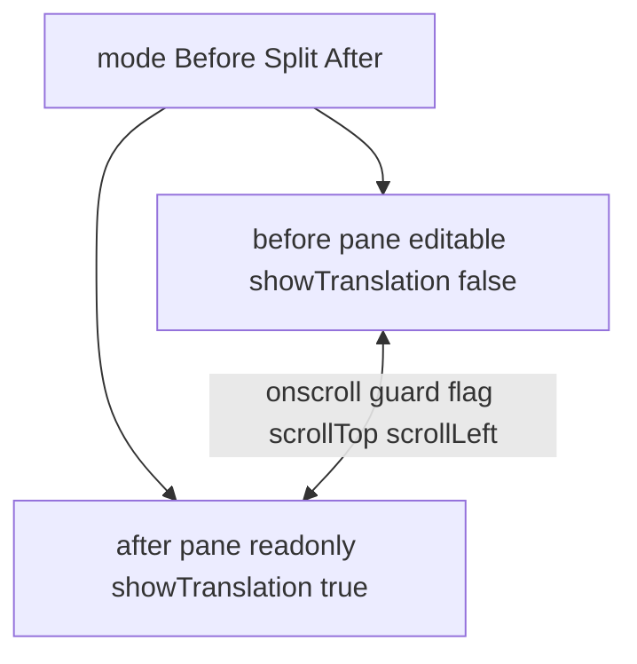
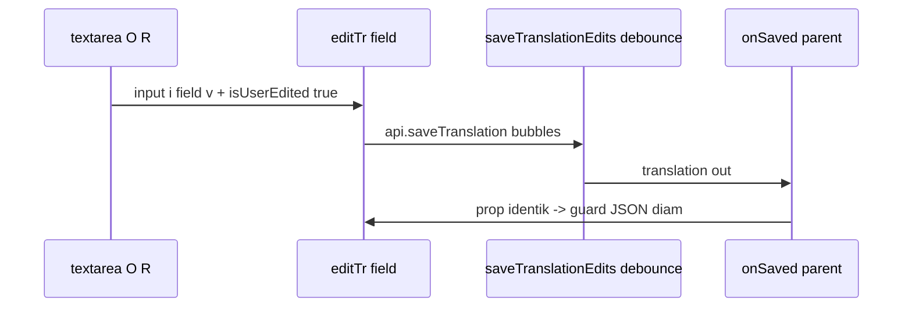

# Design: manual-text + before/after split

## Context

Dua kebutuhan kerja nyata di editor. Pertama, isi/koreksi teks **manual per bubble terpilih tanpa AI**: hari ini `original`/`reading` read-only `
` (EditorPanel.svelte:346) dan hanya terisi dari AI, jadi bubble gagal-OCR tidak bisa dikerjakan. Kedua, **split before/after untuk review akhir**: hari ini satu pane (gambar asli + overlay toggle), tidak bisa bandingkan posisi teks vs artwork sekaligus.

Keputusan user terkunci: (1) **after-lite** (overlay Konva, bukan PNG typeset), (2) **split untuk review akhir** + switcher `Before|Split|After`, (3) **full-manual per bubble terpilih** (original/reading/translated editable).

State hari ini (sudah manual-ready di jalur `translated`): `editTr` (`isUserEdited=true`) -> `saveTranslationEdits` -> `api.saveTranslation`; `mergeUserEdits`/`preserve_user_edits` lindungi `translated` saja (translation.rs:157). Tipe: `BubbleBox {x,y,w,h,confidence,shape,kind,tail}`; `BubbleTranslation {index,original,reading,translated,needsWhitePatch,isUserEdited}`; `PageTranslation {pageId,targetLang,style,model,bubbles[]}`. Canvas: satu Stage, bg Layer + overlayLayer; teks = Konva.Text+Rect saat `showTranslation`; **tanpa** wheel/zoom handler — scroll native `overflow-auto` ganda (EditorPanel.svelte:254, CanvasEditor.svelte:462). Mapping original-px <-> screen via `scale()=holder.clientWidth/imgW`. After-true sudah ada sbg artefak export (`paint_patch` export.rs:280, `render_page_png` export.rs:339) tapi TIDAK diekspos ke preview. Guard sync JSON (CanvasEditor.svelte:46, EditorPanel.svelte:82) reset bila stringify beda.

## Goals / Non-Goals

Goals: (a) textarea manual original/reading/translated per bubble, tersimpan + tahan overwrite AI; (b) tombol "Isi manual" saat `PageTranslation` null; (c) switcher Before|Split|After + scroll-sync native.

Non-Goals: tanpa command backend baru; tanpa zoom/pan Konva; tanpa ubah pipeline detect/translate/batch/glossary/export; tanpa ubah kontrak invoke L1/L2; after = after-lite, bukan WYSIWYG export.

## Decisions

### D1 — manual-text via jalur existing
`
O:>` jadi `<textarea>`; `editTr` diperluas dukung `field: original|reading|translated`, set `isUserEdited=true` untuk ketiganya; simpan via `saveTranslationEdits` yang sama. Debounce save ~500ms pola S6 (ketik -> guard diam).
Ditolak: command baru `save_original` — reuse jalur existing, kontrak L1/L2 utuh.

### D2 — preserve diperluas, satu fungsi
`preserve_user_edits` (translation.rs:157) lindungi `original`/`reading` juga bila `isUserEdited`: clone 3 field, bukan cuma `translated`.
Ditolak: flag terpisah per-field — `isUserEdited` existing cukup, YAGNI.

### D3 — translation kosong via save_translation
Tombol "Isi manual" bila `PageTranslation` null -> bangun `PageTranslation` kosong lokal (bubbles dari `BubbleBox` detect, `original/reading/translated=""`) -> `api.saveTranslation`. Validasi ringan frontend: index unik ikut urutan bubble.
Ditolak: backend init endpoint — `save_translation` tanpa validasi sudah bisa.

### D4 — split-view dua CanvasEditor
`EditorPanel` state `mode: 'before'|'split'|'after'`. Split = dua pane `flex-1`, masing-masing scroll container sendiri berisi `CanvasEditor`; **satu data-URL dishare** (referensi sama), bukan fetch 2x. Before: `editable=true, showTranslation=false`. After: `editable=false, showTranslation=true`, `onSelect` diteruskan ke before (satu sumber state). Mode tunggal = render satu pane saja, hampir gratis.
Props baru: `CanvasEditor { editable: boolean, onSelectForward?: (i:number)=>void }`.

### D5 — scroll-sync native ~10 baris
`onscroll` pane A -> guard flag -> `B.scrollTop/scrollLeft = A`; dan sebaliknya. Native scroll, tanpa transform Konva.
Ditolak: sync transform Konva — tidak ada zoom/pan Konva, tak perlu.

### D6 — crate boundary
Rust: hanya `translation.rs` (preserve). Tanpa command baru, tanpa migrasi DB. Frontend: `EditorPanel.svelte` (D1/D3/D4/D5) + `CanvasEditor.svelte` (props `editable`, forward seleksi). Tauri commands tersentuh: **tidak ada** (reuse `save_translation`, `get_image_preview`).
`ponytail:` after-true via command baru `render_page_png` bila overlay diprotes; zoom/pan Konva bila diminta.

## Risks / Trade-offs

- Guard reset saat ngetik (EditorPanel.svelte:82, CanvasEditor.svelte:46): `onSaved` kembalikan konten identik -> guard diam; tambah debounce ~500ms. Trade-off: save tidak instant, tapi tanpa race.
- Dobel Stage Konva dobel memori base64 1600px -> share satu data-URL, bukan fetch 2x. Trade-off: dua Stage tetap 2x node Konva (wajar untuk review akhir, bukan mode default).
- After-lite != export (tanpa white-patch/font-wrap backend) -> `ponytail:` upgrade after-true (`render_page_png`) bila diprotes. Trade-off sadar: cepat vs WYSIWYG.
- Index duplikat `save_translation` (tanpa validasi backend) -> validasi frontend index unik. Trade-off: cek ringan di client, backend tetap apa adanya.

## Reuse map Kuron -> Studio

| Sumber Kuron | Reuse? | Catatan |
|---|---|---|
| `preserve_user_edits` (translation.rs:157) | Ya, perluas | + original/reading, satu fungsi |
| `paint_patch` / `render_page_png` (export.rs:280,339) | Tidak (ponytail) | after-lite saja; expose bila overlay diprotes |
| `ModelJsonParser` (parser.rs) | Tidak | jalur manual tak lewat parser AI |
