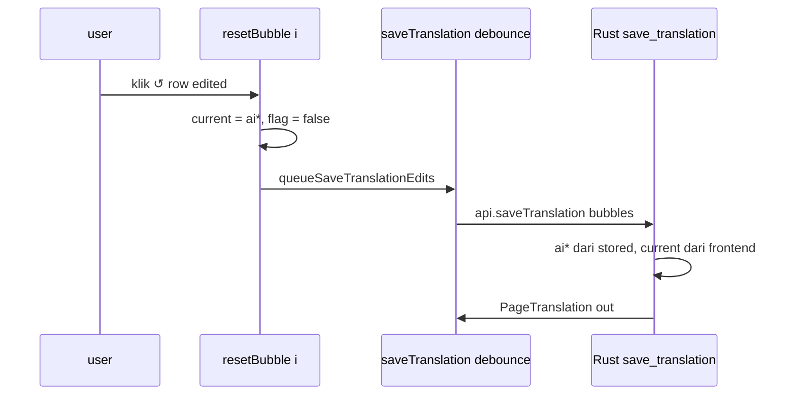

# Design: reset-translation (opsi A — restore AI tanpa panggil AI)

## Context

State hari ini (change `manual-text-before-after`, 12/14 tasks done):

- `BubbleTranslation {index,x,y,w,h,original,reading,translated,
  needsWhitePatch,isUserEdited}` — Rust (`translation.rs:8`) mirror TS
  (`types.ts:106`), serde `rename_all = "camelCase"`.
- Jalur AI: `map_mosaic` / `map_full_image` bangun bubbles (`isUserEdited=false`)
  → `preserve_user_edits_except_vec` timpa 3 field bila edited →
  `persist`/`store_result` ke `projects.json` + cache sqlite.
- Jalur manual: `editTr` set 3 field + `isUserEdited=true` → debounce 500ms →
  `save_translation` (`translate.rs:404`): `page_t.bubbles = bubbles` **menimpa
  buta** → AI hilang permanen.
- `retry_bubble` (`batch.rs:218`): clone `prev`, ganti target dari hasil AI,
  lalu `preserve_user_edits_except` (target selalu dari hasil baru).
- Frontend `mergeUserEdits` (`translation.ts`): restore 3 field + flag by index.

Keputusan user terkunci: **opsi A** — reset = kembalikan teks AI terakhir,
tanpa panggil AI, tanpa ubah bubble lain, badge kembali normal.

## Goals / Non-Goals

Goals: (a) baseline AI murni tersimpan per bubble; (b) manual tak merusaknya;
(c) tombol ↺ per bubble edited → current = AI, flag false, via jalur existing;
(d) batalkan translate per-halaman (opsi B): UI lepas seketika, backend
berhenti di titik cek + status pulih.

Non-Goals: tanpa endpoint reset baru (reuse `save_translation`;
`cancel_translate` adalah satu-satunya command baru, khusus cancel);
tanpa reset massal per-halaman; tanpa re-translate; tanpa migrasi sqlite;
tanpa cancel batch penuh (opsi C).

## Decisions

### D1 — tiga field `ai*`, bukan satu struct, bukan satu field

`aiOriginal: String, aiReading: String, aiTranslated: String`,
masing-masing `#[serde(default)]` + TS wajib-string.

```
BubbleTranslation {
  original, reading, translated,   // current (manual/AI)
  aiOriginal, aiReading, aiTranslated, // baseline AI terakhir — manual TAK sentuh
  needsWhitePatch, isUserEdited,
}
```

Ditolak: struct nested `ai: AiText` — serde nested + TS mirror + semua
konstruktor `mk()` di test ikut berubah; 3 field datar = diff terkecil,
konsisten dengan gaya existing (semua field datar + `#[serde(default)]`).
Ditolak: satu field `aiTranslated` saja — user edit 3 field (D2 change
sebelumnya), reset `original`/`reading` ikut kembali normal.

### D2 — siapa isi `ai*`: hanya jalur AI

| Jalur | `ai*` | current + flag |
|---|---|---|
| `map_mosaic` / `map_full_image` | = hasil AI | = hasil AI, `false` |
| `preserve_user_edits_except_vec` (edited) | **dipertahankan dari old** (baseline lama, bukan AI baru yg ditolak) | = manual, `true` |
| `preserve_user_edits_except_vec` (unedited) | = AI baru | = AI baru, `false` |
| `retry_bubble` target | = AI baru (baseline baru) | = AI baru, flag **false** (kembali normal) |
| `save_translation` | **dari stored, abaikan kiriman frontend** | dari frontend |

Poin kritis D2-baris-2: bubble edited yang survive re-translate membawa
`ai*` LAMA — benar, karena "AI terakhir yang user lihat" untuk bubble itu
adalah AI sebelum ia edit. AI baru untuk bubble itu memang ditolak user.

Poin kritis D2-retry: retry = user MINTA AI baru → hasilnya jadi current
sekaligus baseline, flag false. Ini konsisten: retry sudah jadi "reset via AI"
(opsi B) sejak awal.

### D3 — `save_translation` merge, bukan pass-through

```rust
// sketsa — bukan kode final
let stored: HashMap<usize, &BubbleTranslation> = old.bubbles by index;
page_t.bubbles = bubbles.into_iter().map(|mut b| {
    if let Some(s) = stored.get(&b.index) {
        b.aiOriginal = s.aiOriginal.clone(); // dst — frontend TAK dipercaya
    }
    b
}).collect();
```

Ditolak: percaya kiriman frontend — frontend bisa kirim `ai*` kosong/stale
(race debounce), merusak baseline diam-diam. Komentar anti-tamper wajib di kode.
Ditolak: command reset baru — reset = edit biasa (current=AI, flag=false)
lewat `save_translation` existing; kontrak L1/L2 utuh.

### D4 — tombol ↺ per row, syarat tampil

`resetBubble(i)`: `translation.bubbles[i] = {...b, original: b.aiOriginal,
reading: b.aiReading, translated: b.aiTranslated, isUserEdited: false}` →
`queueSaveTranslationEdits()` (debounce existing, bukan save langsung).

Tombol hanya tampil bila `b.isUserEdited && aiTranslated non-kosong`
(menutup risiko bubble pre-fitur tanpa baseline → reset jadi kosong).
`ponytail:` bila diprotes — fallback banner "belum ada baseline AI".

### D5 — backward-compat tanpa migrasi

- `#[serde(default)]` per field → `projects.json` lama ke-load, `ai*` = `""`.
- Cache payload lama: `apply_cached` persist tanpa baseline (jendela basi kecil,
  self-healing: translate ulang isi `ai*`). Tanpa versioning cache — YAGNI.
- `mergeUserEdits` (TS): bubble edited ikut bawa `ai*` old
  (`{...b, ai*: old.ai*, ...}` — satu baris dalam spread existing).

### D6 — cancel per-halaman opsi B (frontend lepas + backend berhenti)

Frontend (`TranslatePanel`): saat `busy`, tombol jadi "Batal"; klik set
`cancelled=true`, `void api.cancelTranslate(page_id)`, `busy=false`,
`info="Dibatalkan"`. Guard di `translate()`: resolve telat → return tanpa
`onTranslated`; `catch` telat → return tanpa `onError`.

Backend:
- `AppState.cancel: Mutex<HashSet<String>>` (std Mutex, konsisten dengan
  `store`/`db`) + stash `Mutex<HashMap<String, PageStatus>>` prev-status.
- `claim_page` stash prev-status; `cancel_translate { page_id }` insert flag;
  path cancel restore stash via helper baru (bukan `fail_page`).
- `backoff_translate(state, page_id, …)` cek flag tiap iterasi +
  `tokio::select!` saat sleep 2s/4s/8s (fitur macros sudah ada); cek ulang
  sekali pasca-backoff sebelum map/store (buang hasil POST yg keburu selesai).
- Semua caller (`translate_prep`, `run_work`, `retry_bubble`) update signature;
  error cancel = `Err("dibatalkan oleh user")`, skip `fail_page`/persist.

Ditolak: abort handle reqwest per-request — lifecycle + borrow ribet; satu
in-flight POST dibuang hasilnya, cukup (token satu call, sadar).
Ditolak: cancel batch penuh (opsi C) — semaphore/mpsc/progress tetap jalan;
batal per-halaman di dalam batch ikut berhenti cepat sebagai efek samping.

## Risks / Trade-offs

- Baseline lama ikut bubble edited selamanya (D2-baris-2): bila AI model
  berganti, baseline bubble edited tetap dari model lama. Sadar: itu memang
  "AI yang user tolak" — reset = kembali ke sana, bukan ke model baru.
- `save_translation` kini baca stored dulu: page tanpa translation
  (`unwrap_or` default) → `ai*` kosong → tombol tak tampil (D4 guard).
- Dua sumber kebenaran current-vs-ai dalam satu struct: drift hanya mungkin
  bila ada jalur tulis baru lupa isi `ai*` — mitigasi: test compile-time
  tidak ada; catat di spec scenario "jalur AI baru WAJIB isi ai*".


